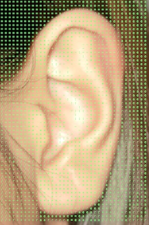
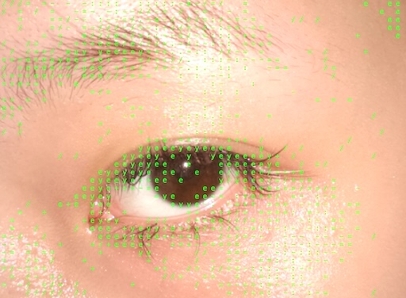

# Chat Log

---

## User

*(4 screenshots uploaded: close-up eye/ear/nose photos with green symbol overlay; two CSS/MDN reference screenshots on selectors and font-family; a VS Code screenshot showing `style.css` with `body` styles)*

我该怎么在css里修改font 以及图片的位置，怎么定位到具体的哪一段话什么字体，我应该如何去用教的方法让在左边的图片移动到右边。

## Assistant

# 定位到具体文字并修改字体

你截图里的笔记已经讲了三种选择器（标签、类、ID），实际项目里最常用的是**类选择器**，因为你往往只想改某一段/某几段文字，而不是页面上所有同类型的标签。

**步骤：**

1. 在 HTML 里给你想改的那段文字加一个 class，比如：
```html
<p class="intro-text">这是我想改字体的这一段</p>
```

2. 在 CSS 里用 `.类名` 来选中它：
```css
.intro-text {
    font-family: "Gill Sans Extrabold", sans-serif;
}
```

这样就只有带 `intro-text` 这个 class 的段落会变字体，其他 `<p>` 不受影响——这就是"定位到具体是哪一段话"的方法。如果只有一个独一无二的元素（比如页面唯一的标题），也可以用 ID（`#id名`），但如果以后可能有多个类似元素，还是建议用 class，更灵活可复用。

# 图片从左边移动到右边

你截图里的 `style.css` 目前是给 `body` 设置整体样式，还没看到针对图片本身的规则。要移动图片位置，取决于你现在图片是怎么排布的，常见几种方法：

**方法一：float（最基础，适合文字环绕图片的排版）**
```css
img {
    float: right;   /* 改成 left 就靠左 */
    margin-left: 20px;
}
```

**方法二：text-align（如果图片是 inline/inline-block，且父元素包裹着它）**
```css
.image-wrapper {
    text-align: right;  /* 让图片靠右 */
}
```

**方法三：margin（精确控制，比如让图片靠右对齐）**
```css
img {
    display: block;
    margin-left: auto;
    margin-right: 0;
}
```

**方法四：flexbox（如果图片和文字是在同一个容器里横排）**
```css
.container {
    display: flex;
    justify-content: flex-end; /* 靠右；flex-start 靠左 */
}
```

如果你把图片对应的 HTML 结构（img 标签在哪个容器里，class 叫什么）发给我看看,我可以直接帮你写出对应你项目的具体代码，而不是泛泛的例子。

---

## User

*(1 screenshot uploaded: VS Code file explorer showing `allimage` folder with ear.jpg, eye.jpg, me.png, mouth.jpg, nose.jpg, and `img { float: right; margin-left: 20px; }` in style.css)*

我想要一张左边一张右边怎么调整，是单独点名每一张图片吗

## Assistant

对，如果你想让**不同的图片有不同的位置**，光写 `img { float: right; }` 是不够的——这条规则会同时套用到页面上所有 `` 标签，没法区分哪张往左哪张往右。

有几种方法可以单独控制：

## 方法一：给每张图片单独加 class（最推荐，最清晰）

**HTML：**
```html


```

**CSS：**
```css
.img-left {
    float: left;
    margin-right: 20px;
}

.img-right {
    float: right;
    margin-left: 20px;
}
```

这样以后不管有多少张图，你想让哪张往哪边，只要改它的 class 名就行，不用记位置或顺序。

## 方法二：用 nth-of-type（不改 HTML，按顺序选）

如果两张图片都没有 class，可以按它们在页面里出现的顺序来选：

```css
img:nth-of-type(1) {
    float: left;
    margin-right: 20px;
}

img:nth-of-type(2) {
    float: right;
    margin-left: 20px;
}
```

意思是"第一张 img 靠左，第二张 img 靠右"。这个方法快，但如果以后调整图片顺序或插入新图片，位置就会跟着乱，所以适合图片数量固定、不常变动的情况。

## 建议

如果你的项目以后可能会加更多图片（看你 allimage 文件夹里已经有 5 张了），**用 class 的方式更保险**，语义也更清楚——一眼就能看出这张图片"应该"在左边还是右边，不用去数它是第几个。

---

## User

*(1 screenshot uploaded: VS Code showing style.css with `imgleft { float: left; margin-right: 20px; }` and `imgright { float: right; margin-left: 20px; }` — both missing the leading dot)*

为什么没有变化，以及font family还可以查哪些

## Assistant

看到问题了 —— 在第 24 行和 29 行，你写的是：

```css
imgleft {
    float: left;
    margin-right: 20px;
}

imgright {
    float: right;
    margin-left: 20px;
}
```

**少了点号 `.`**。没有点号的话，CSS 会把 `imgleft` 和 `imgright` 当成**标签名**来找，就像找 `<p>`、`` 一样，去找一个叫 `<imgleft>` 的 HTML 标签——但这个标签根本不存在，所以规则完全不生效。

## 修改方法

**CSS 里加上点号：**
```css
.imgleft {
    float: left;
    margin-right: 20px;
}

.imgright {
    float: right;
    margin-left: 20px;
}
```

**然后检查 HTML 里对应的图片有没有写 class="imgleft" / class="imgright"**，比如：
```html


```

如果 HTML 里图片的 class 名字跟 CSS 里的对不上（比如一个叫 `left-img` 一个叫 `imgleft`），也一样不会生效——两边名字必须完全一致。

---

## font-family 还可以查哪些

**1. Web 安全字体（不用担心用户电脑上没有）**
这些字体几乎所有系统都自带，最稳妥：
- 衬线体：`Georgia`, `Times New Roman`, `Garamond`
- 无衬线体：`Arial`, `Helvetica`, `Verdana`, `Tahoma`, `Trebuchet MS`
- 等宽体：`Courier New`, `Consolas`

**2. Google Fonts（免费、种类最多，网页设计最常用）**
网站：fonts.google.com，可以直接搜索、预览、复制代码。用法是先在 HTML `<head>` 里引入字体链接，再在 CSS 里写字体名，我可以在你需要的时候教你具体怎么引入。

**3. MDN 的系统字体关键字清单**
除了 `serif` / `sans-serif` / `monospace`，还有 `cursive`（手写体）、`fantasy`（装饰性字体）、`system-ui`（跟随用户系统默认字体），可以在 CSS 里直接用。

如果你想让整个页面用某种 Google Fonts 的字体，告诉我大概想要什么风格（比如衬线的、手写的、极简的），我可以帮你选一个具体字体并写出引入代码。

---

## User

*(2 screenshots uploaded: VS Code showing `p { font-family: cursive; }`; macOS Font Book showing decorative font previews like DIN Condensed, Domaine Display, DS Admiral, DS Forelle, Fahkwang, etc.)*

为什么没有变化，可以接入自己电脑的字体吗，就像这些

## Assistant

两个问题分开说：

## 为什么 `cursive` 好像没变化

`cursive`、`sans-serif`、`serif`、`monospace` 这些不是具体字体，而是**通用类别关键字**——浏览器会在你电脑上随便找一个属于这个类别的字体来顶替。Mac 上 `cursive` 通常会自动对应到系统里一个手写风格的字体（比如 Apple Chancery 或类似的），效果可能很不明显，容易让人觉得"好像没变"。

检查几个可能原因：
1. **确认你改的 CSS 文件是不是当前 HTML 页面引用的那个**——你之前截图里同时开着好几个项目文件夹（class-demos、project1、project2...），很容易改错了文件。
2. **打开浏览器开发者工具（右键 → 检查）**，点选目标文字，看 Styles 面板里 `font-family: cursive` 有没有生效、有没有被别的规则覆盖（比如下面还有一条 `p { font-family: ... }` 把它盖掉了）。
3. **强制刷新页面**（Mac 上 `Cmd + Shift + R`），有时候浏览器缓存了旧的 CSS。

## 能不能直接用电脑里装的字体（像 Font Book 里这些）

**可以，但有个重要前提：只对"你自己"有效。**

如果你在 CSS 里直接写字体的确切名字，比如：
```css
p {
    font-family: "DS Forelle", cursive;
}
```

**这在你自己电脑上打开网页会生效**——因为浏览器会去你系统里找这个名字的字体，找到了就用。但如果你把网站发布出去，或者别人在他们的电脑上打开，**他们的系统里大概率没有装 "DS Forelle" 这个字体**，浏览器就会 fallback（回退）到你写的备用字体（比如这里的 `cursive`）。

也就是说：**本地字体只能保证你自己看到效果，没法保证别人也看到一样的效果。**

## 如果想让所有人都看到同样的字体，怎么做

有两个可靠方法：

**方法一：Google Fonts（最简单，免费在线字体库）**
不依赖用户电脑，字体文件从网上加载，谁打开都一样。

**方法二：`@font-face` 自己上传字体文件**
如果你就是想用 Font Book 里这些好看的字体（比如 DS Forelle、Fahkwang 这种），只要你有这个字体的文件（.ttf / .otf），可以把文件放进项目文件夹，再用 `@font-face` 引入，这样即使是你自己下载的字体，别人打开也能看到同样效果。

你现在这个项目是只给自己/老师在同一台电脑上看，还是打算发布出去给别人访问？如果是后者，我可以教你怎么用 `@font-face` 把你喜欢的这些字体真正嵌入到网页里。

---

## User

润色：
I want to keep this as my free writing note books, divided into 4 categroy with the 4 senses, And they way to present the image in essential. I want to reading really feeling everything that come to them.

## Assistant

这是我把原意理顺后的润色版本：

**润色版：**
> I want to keep this as a free-writing notebook, divided into four categories corresponding to the four senses. The way the images are presented should be minimal — almost essential — so that readers can truly *feel* everything that reaches them.

**更简洁的版本：**
> This is meant to be a free-writing notebook, organized into four sections around four of the senses. I want the images to be presented as minimally as possible, so the reader feels — rather than just sees — everything on the page.

几点说明我做了哪些调整：
- "4 categroy" → "four categories"（拼写 + 数字建议英文书面写法用 four 而非 4，更正式）
- "with the 4 senses" → "corresponding to the four senses"，更清楚表达"对应"关系
- "the way to present the image in essential" 这句原意有点模糊，我理解成"呈现图像的方式应该是极简/本质化的"，所以改成 "presented as minimally as possible" 或 "essential" 保留你原本的用词
- "I want reading really feeling everything that come to them" → 改成 "I want the reader to feel — rather than just see — everything on the page"，把动作主语理顺（是"读者"在感受，不是"reading"这个动作本身）

如果你想表达的"四感"具体指哪四种感官（比如视觉、触觉、听觉、嗅觉，或者其他组合），可以告诉我，我可以帮你在句子里更精确地点出来，会让整段话更有画面感。

---

## User

润色：The outcome is ok like this but the code cover it is not that obvious, I thought of changing the whole image into the text and delete the orignal image as the background, so that the effect is much more close to above, but the shape of Facial Features is really Blurred and when I type all the facial features Composed of Symbols, when using the command s, the The gaps in the middle are automatically filled, so it is not possible to create spacing.

## Assistant

这是润色版本：

**润色版：**
> The outcome works well as it is, but the code overlay isn't obvious enough. I considered converting the entire image into text and removing the original image as a background, so the effect would be closer to what I described above. However, the shapes of the facial features become too blurred, and when composing the facial features entirely out of symbols using the "s" command, the gaps in the middle get automatically filled in — making it impossible to create proper spacing.

**更简洁的版本：**
> The result works, but the code overlay isn't prominent enough. I considered replacing the original image entirely with text, removing it as a background layer, to get closer to the effect described above. But this blurs the shape of the facial features — when the features are composed purely of symbols using the "s" command, the gaps automatically fill in, making it impossible to leave proper spacing.

几点调整说明：
- "The code cover it is not that obvious" → "the code overlay isn't obvious enough"（"cover" 应该是指你的符号/代码覆盖层，用 "overlay" 更准确）
- "so that the effect is much more close to above" → "so the effect would be closer to what I described above"（把 "above" 补充完整，指代更清楚）
- "the shape of Facial Features is really Blurred" → "the shapes of the facial features become too blurred"
- "when using the command s" → "using the 's' command"（我假设这是某个具体指令/快捷键，如果指的是别的东西，比如某个软件功能或参数，告诉我我可以调整措辞）
- "The gaps in the middle are automatically filled" → "the gaps in the middle get automatically filled in"，逻辑上接在"无法留白"之前，让因果关系更顺

如果 "command s" 具体指的是某个软件/工具里的功能（比如 Processing、p5.js 里的某个函数，或者字体渲染工具的某个参数），可以告诉我，我可以把这部分表达得更专业准确一些。

---

## User

The overall was a excercise to truely takes hand on the skill myself, I found that during the process, even the initial ideas was good, you have to handle the skill to really make the effect out, this was the frustrating but also motivating process, Each slice of code can make a huge difference and the detail really plays an important role.
I feel like I need to learn and open to more source since I don't even know to insert the GIF is fine , I have been under the structure for a long time and really need to break out and test the limit.

## Assistant

这是润色版本：

**润色版：**
> Overall, this was an exercise in truly getting hands-on with the skill myself. Throughout the process, I realized that even when the initial idea is good, you still have to master the technical skill to actually bring the effect to life. This was a frustrating but also motivating process — every slice of code can make a huge difference, and the details really do matter.
>
> I feel like I need to learn more and stay open to more resources, since I didn't even know inserting a GIF was an option. I've been working within the same structure for a long time, and I really need to break out of it and test my limits.

**更简洁的版本：**
> This was an exercise in getting truly hands-on with the skill. I learned that even a good initial idea means little without the technical ability to execute it — a process that was frustrating but motivating in equal measure. Every line of code can make a huge difference, and the details really matter.
>
> I clearly need to explore more resources and stay open to new approaches — I didn't even realize inserting a GIF was possible. I've been confined to the same structure for too long, and it's time to break out and test my limits.

几点调整说明：
- "you have to handle the skill" → "you still have to master the technical skill"（"handle" 改成 "master" 更准确表达"掌握"的意思）
- "Each slice of code" → "every slice of code" / "every line of code"（"slice" 保留了你原本的用词，也可以换成更常见的 "line"，两个都自然）
- "I don't even know to insert the GIF is fine" → "I didn't even know inserting a GIF was an option"（原句语法有点绕，这样表达更清楚：你不知道"插入 GIF 也是可以的/允许的"）
- "I have been under the structure for a long time" → "I've been working within the same structure for a long time" / "I've been confined to the same structure for too long"（"under the structure" 改成更自然的英文表达，"confined to" 更强调"被困住"的感觉，如果你想传达更强烈的挣脱感可以用这个版本）
- 分成两段，让"技术反思"和"未来方向"的逻辑更清楚

如果这段话是要放进作品集的 reflection 或者 artist statement 里，我也可以帮你调整成更适合正式提交的语气（比如减少口语化的转折词，让论证更连贯）。

---

## User

Export this entire chat as "chatlog.md"
